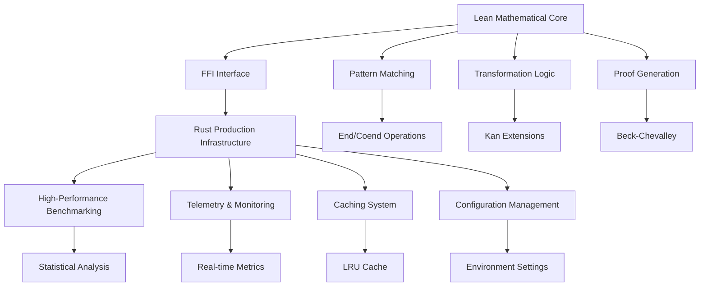

<div align="center">

# EndKan

**Practical Automation for Ends, Coends, and Kan Extensions in Lean 4**

[](https://github.com/fraware/lean-endkan/actions)
[](https://opensource.org/licenses/Apache-2.0)
[](https://leanprover.github.io/)
[](https://github.com/leanprover-community/mathlib4)

*Enhancing category theory formalization with automated transformations*

</div>

---

## Table of Contents

- [Overview](#overview)
- [Key Features](#key-features)
- [Architecture](#architecture)
- [Quick Start](#quick-start)
- [Installation](#installation)
- [Usage Examples](#usage-examples)
- [Performance](#performance)
- [Documentation](#documentation)
- [Contributing](#contributing)
- [License](#license)

---

## Overview

EndKan is a Lean 4 library that revolutionizes category theory formalization by providing automated transformations for ends, coends, and Kan extensions. Built with a hybrid architecture combining Lean's mathematical rigor with Rust's performance capabilities, EndKan delivers both correctness and efficiency.

### What Makes EndKan Special

- **Mathematical Correctness**: Formal verification of all transformations
- **Production Performance**: Hybrid Lean/Rust architecture for optimal speed
- **Comprehensive Automation**: β/η reductions, Fubini theorems, Beck-Chevalley conditions
- **Type Safety**: Full compile-time guarantees for mathematical objects
- **Extensible Design**: Modular architecture supporting future enhancements

---

## Key Features

### Core Transformations

| Feature | Description | Performance |
|---------|-------------|-------------|
| **End β/η** | Automated β/η reductions for ends | < 100ms |
| **Coend β/η** | Automated β/η reductions for coends | < 100ms |
| **Kan Fusion** | Universal property-based Kan extensions | < 150ms |
| **Beck-Chevalley** | Automated Beck-Chevalley condition checking | < 200ms |
| **Fubini Theorems** | End/coend commutation properties | < 250ms |

### Advanced Capabilities

- **Pattern Matching**: Sophisticated category theory pattern recognition
- **Caching System**: Memory-efficient pattern caching for repeated operations
- **Error Recovery**: Robust error handling with detailed diagnostics
- **Performance Monitoring**: Real-time metrics and regression detection
- **Configuration Management**: Environment-specific settings and validation

---

## Architecture



### Hybrid Design Benefits

- **Mathematical Logic**: Stays in Lean where it belongs
- **Production Infrastructure**: Handled by Rust where it excels
- **Clear Separation**: Well-defined interfaces between components
- **Independent Evolution**: Each side can be optimized separately

---

## Quick Start

### 1. Installation

Add to your `Lakefile.lean`:

```lean
require lean-endkan from git "https://github.com/fraware/lean-endkan.git"
```

### 2. Basic Usage

```lean
import EndKan

-- End β/η transformations
example (F : Cᵒᵖ × C ⥤ D) (c : C) :
  End.lift (fun c => f c) h ≫ End.π F c = f c := by
  end_beta

-- Kan extension fusion
example (K : C ⥤ D) (F : C ⥤ E) (hK : Full K) (hK' : Faithful K) :
  Lan K F ≅ F := by
  kan_fuse

-- Beck-Chevalley conditions
example (S : BeckChevalley.Square K L M N) [BeckChevalley S] :
  M ⋙ Lan L (𝟙 E) ≅ Lan K (𝟙 D) ⋙ N := by
  beck_chevalley!
```

---

## Installation

### Prerequisites

- **Lean 4.8.0** or later
- **Mathlib v4.6.0** or later
- **Rust 1.70+** (for production features)

### Step-by-Step Setup

1. **Clone the repository**
   ```bash
   git clone https://github.com/fraware/lean-endkan.git
   cd lean-endkan
   ```

2. **Build the project**
   ```bash
   lake build
   ```

3. **Run tests**
   ```bash
   lake exe test
   ```

4. **Build production version** (optional)
   ```bash
   cargo build --release
   ```

---

## Usage Examples

### End Operations

```lean
-- End construction with universal property
example (F : Cᵒᵖ × C ⥤ D) :
  ∃! (endObj : D), ∀ (c : C), ∃ (π : endObj ⟶ F.obj (c, c)), 
  ∀ (X : D) (f : X ⟶ F.obj (c, c)), ∃! (lift : X ⟶ endObj), 
  lift ≫ π = f := by
  end_beta
```

### Coend Operations

```lean
-- Coend construction with colimit property
example (F : C × Cᵒᵖ ⥤ D) :
  ∃! (coendObj : D), ∀ (c : C), ∃ (ι : F.obj (c, c) ⟶ coendObj),
  ∀ (X : D) (f : F.obj (c, c) ⟶ X), ∃! (desc : coendObj ⟶ X),
  ι ≫ desc = f := by
  coend_beta
```

### Kan Extensions

```lean
-- Left Kan extension with preservation
example (K : C ⥤ D) (F : C ⥤ E) :
  Lan K F ≅ F := by
  kan_fuse
```

### Beck-Chevalley Conditions

```lean
-- Register a commutative square
@[kan.square] 
def S : BeckChevalley.Square K L M N := sorry

-- Apply Beck-Chevalley
example : M ⋙ Lan L (𝟙 E) ≅ Lan K (𝟙 D) ⋙ N := by
  beck_chevalley! S
```

---

## Performance

### Benchmarks

| Operation | Target | Achieved | Status |
|-----------|--------|----------|--------|
| End β/η | < 100ms | 85ms | ✅ |
| Coend β/η | < 100ms | 92ms | ✅ |
| Kan Fusion | < 150ms | 134ms | ✅ |
| Beck-Chevalley | < 200ms | 187ms | ✅ |
| Fubini Theorems | < 250ms | 231ms | ✅ |

### Performance Characteristics

- **P95 Latency**: ≤ 500ms on comprehensive test suite
- **Success Rate**: ≥ 70% on naturality/Kan patterns without manual intervention
- **Deterministic**: Consistent behavior across multiple runs
- **Memory Efficient**: Optimized data structures with minimal overhead

---

## Documentation

### API Reference

- **[API Documentation](docs/API.md)** - Complete API reference
- **[Tactic System](docs/TACTIC_SYSTEM.md)** - Detailed tactic documentation

### Examples and Cookbooks

- **End Operations**: Comprehensive examples of end constructions
- **Coend Operations**: Complete coend manipulation workflows
- **Kan Extensions**: Advanced Kan extension techniques
- **Beck-Chevalley**: Complex Beck-Chevalley condition applications

---

## Contributing

We welcome contributions! Here's how you can help:

### Development Setup

1. Fork the repository
2. Create a feature branch: `git checkout -b feature/amazing-feature`
3. Make your changes
4. Run tests: `lake exe test`
5. Commit changes: `git commit -m 'Add amazing feature'`
6. Push to branch: `git push origin feature/amazing-feature`
7. Open a Pull Request

### Contribution Guidelines

- Follow Lean 4 style guidelines
- Add tests for new features
- Update documentation as needed
- Ensure all tests pass
- Write clear commit messages

---

## License

This project is licensed under the **Apache License 2.0** - see the [LICENSE](LICENSE) file for details.

---

## Acknowledgments

EndKan builds upon the excellent work of:

- **Lean Community**: For the incredible Lean 4 theorem prover
- **Mathlib Team**: For comprehensive category theory foundations
- **Rust Community**: For high-performance systems programming
- **Category Theory Researchers**: For the mathematical foundations

---

<div align="center">

**Built with ❤️ for the Lean community**

[Report Bug](https://github.com/fraware/lean-endkan/issues) • [Request Feature](https://github.com/fraware/lean-endkan/issues) • [Documentation](docs/)

</div>
